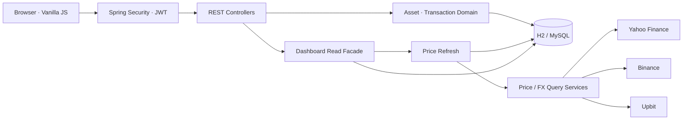

# Folio — Personal Asset Dashboard

> 현금·은행·국내외 주식·암호화폐를 한곳에 모아, **현재 가치와 손익이 왜 그렇게 계산됐는지**까지 확인하는 개인 자산 대시보드입니다.

Folio는 증권 주문 앱이나 금융기관 연동 서비스가 아닙니다. 사용자가 보유 자산과 거래를 직접 기록하면 외부 시세와 환율을 결합해 원화 기준 Portfolio를 보여주는 **수동 입력형 MVP**입니다.

이 프로젝트의 목표는 기능을 크게 확장하는 것이 아니라 다음 질문에 답할 수 있는 작은 제품을 만드는 것이었습니다.

- 여러 앱에 흩어진 자산을 한눈에 볼 수 있는가?
- USD·USDT·KRW 자산의 원가와 현재 가치를 혼동하지 않고 계산할 수 있는가?
- 사용자가 거래나 최초 보유 수량을 잘못 입력해도 거짓 매매 없이 고칠 수 있는가?
- 외부 시세를 모를 때 `0`이나 현재 환율로 그럴듯한 숫자를 만들지 않을 수 있는가?
- 인증·인가와 동시성 같은 서버의 기본 정합성을 코드 구조로 보장할 수 있는가?

## 주요 화면과 사용자 흐름

1. 이메일·닉네임·비밀번호로 가입하고 로그인합니다.
2. 가입 시 KRW·USD·USDT 투자 대기자금이 잔액 `0`으로 준비됩니다.
3. 현금·은행·주식·암호화폐를 등록합니다.
4. 매수·매도는 같은 통화의 투자 대기자금과 함께 정산됩니다.
5. Dashboard에서 총자산, 오늘 손익, Position, Allocation, 환율, 최근 활동을 확인합니다.
6. 자산을 누르면 거래 내역, 평균 매수가, 실현손익, 최근 시장가격을 확인하고 오입력을 정정할 수 있습니다.
7. 오늘 손익을 누르면 Asset Analysis에서 기간별 Portfolio 흐름과 기여도를 확인합니다.
8. News에서 공용 공식자료를 보거나, 현재 등록한 자산과 관련된 자료만 필터링합니다.

| 영역 | 구현 내용 |
|---|---|
| Dashboard | 총 투자자산, 오늘 손익, Position, 투자 대기자금, Allocation, 최근 거래, USD/KRW·USDT/KRW |
| Asset | CASH·BANK·STOCK·CRYPTO 등록, 유형별 입력 폼, Soft Delete·복구, 현재가·환율 수동 보정 |
| Transaction | BUY·SELL·DEPOSIT·WITHDRAW, 동일 통화 정산, 거래 삭제 후 시간순 replay |
| Correction | 최초 보유 수량 정정, 잘못 입력한 거래 삭제, 정산 자산까지 원자적으로 되돌리기 |
| Market data | Yahoo Finance 주식·USD/KRW, Binance 암호화폐, Upbit USDT/KRW, 15분 캐시와 last-good 폴백 |
| Search | KRX KIND KOSPI·KOSDAQ 2,595종목 로컬 자동완성, 사용자 심볼과 Yahoo 조회 심볼 분리 |
| Analysis | 09:00 KST 기준 Portfolio Snapshot, 외부 입출금을 보정한 Daily PnL, 기간별 자산 분석 |
| Financial Evidence | 가격·환율·평단·최근 거래 근거 조회, `CONFIRMED/PARTIAL/UNAVAILABLE` 판정 |
| Personal Evidence | 등록 자산별 자료·메모 붙여넣기, 출처 메타데이터·중복 방지·키워드 검색, Agent용 `searchSymbolEvidence` Tool |
| Shared News | 공용 공식자료 저장, 출처 화이트리스트, 비동기 수집·중복 제거·TTL, 전체/내 자산 필터, NIM 한국어 요약 캐시 |
| Auth | 짧은 Access Token + 회전·폐기되는 Refresh Token, 로그인 잠금·IP 요청 제한, BCrypt 비밀번호, 이메일 중복확인, 비밀번호 변경·회원 탈퇴 감사 로그, 소유권 기반 404 인가 정책 |
| UX | 금액 가리기, 모바일 현재가 펼쳐보기, 빈 값·stale 상태 표시, 구체적인 오류 안내 |

## 설계 개요



외부 조회와 DB 쓰기를 한 트랜잭션 안에 섞지 않습니다. 시세를 먼저 조회하고, 성공한 값만 짧은 별도 트랜잭션으로 반영합니다. Dashboard는 여러 도메인의 읽기 결과를 조립하지만 계산 규칙을 소유하지 않습니다.

### 패키지 구조

```text
com.assetdashboard
├── global
│   ├── config          Security, Jackson, MVC 설정
│   ├── exception       공통 에러 응답과 낙관적 락 처리
│   └── security        JWT 필터, 현재 사용자 주입
├── domain
│   ├── user            회원가입·로그인·사용자
│   ├── asset           Aggregate Root, Position과 평가 계산
│   └── transaction     거래 기록, 정산, replay 조율
├── dashboard
│   ├── facade          Dashboard 읽기 모델 조립
│   └── snapshot        Daily PnL과 Portfolio History
├── evidence
│   ├── calculation     Agent용 계산 근거와 확인 가능 수준 판정
│   ├── document        symbol 자료 수동 수집·출처 표시·검색
│   ├── news            공용 뉴스의 구조화된 Agent Evidence Tool
│   ├── evaluation      골든셋 로딩·규칙 기반 채점 하네스
│   └── trace           Agent Run·Span 트리·평가 이력
├── news                공용 피드·공식 출처 수집·비동기 작업·중복 제거
└── infra.price
    ├── cache           15분 인메모리 시세 캐시
    ├── fx              USD/KRW·USDT/KRW 조회
    ├── history         최근 시장가격 조회
    ├── stock           Yahoo Finance
    └── crypto          Binance·Upbit
```

## 핵심 설계 결정

### 1. `Asset`을 Aggregate Root로 두었습니다

`Asset`은 단순한 DB 행이 아니라 현재 Position의 정합성을 지키는 주체입니다. 수량·평단가·실현손익은 Controller나 Service에서 직접 수정하지 않고 `Asset.buy()`, `sell()`, `deposit()`, `withdraw()`, `replay()` 같은 도메인 메서드를 통해서만 바뀝니다.

`Transaction`은 Asset에 종속된 사건 기록입니다. 거래가 늘어날 때 Asset을 조회할 때마다 전체 이력을 메모리에 올리지 않도록 별도 Repository로 저장하되, 거래 조회 전에는 항상 부모 Asset의 소유권을 먼저 검증합니다.

### 2. 현재 가치와 취득 원가의 환율을 분리했습니다

외화 자산은 같은 환율 하나로 모든 값을 계산하면 과거 원가가 현재 환율에 따라 바뀌는 문제가 생깁니다.

```text
현재 평가금액(KRW) = 보유수량 × 현재가(원통화) × 현재 환율
취득 원가(KRW)     = 보유수량 × 원화 평균 매입단가
미실현손익          = 현재 평가금액 - 취득 원가
실현손익            = (매도가 × 매도시점 환율 - 원화 평균 매입단가) × 매도수량
```

- `avgPriceOriginal`: USD·USDT 등 원통화 기준 평균 매입단가, 화면 표시용
- `avgPrice`: 각 매수 시점 환율까지 반영해 확정한 KRW 평균 매입단가
- `currentPrice`: 현재 시장가격, 원통화 기준
- `exchangeRate`: 현재 Portfolio 평가에 사용하는 원/통화 환율
- `Transaction.exchangeRate`: 해당 거래 당시의 환율

따라서 과거 매수 원가는 그대로 유지되고, 현재 원화 평가금액만 최신 시세와 환율에 따라 움직입니다. 현재 손익은 가격 변동과 환율 변동을 합친 결과이며, 가격 손익과 환차손익의 분리는 MVP 범위에서 제외했습니다.

### 3. 자동 환율과 사용자 입력 환율을 API 계약으로 구분했습니다

화면에 현재 환율을 보여주는 것과 사용자가 과거 거래 환율을 직접 입력한 것은 숫자만 보면 구분할 수 없습니다. 이 문제를 `exchangeRateMode`로 명시했습니다.

| 거래 | 규칙 |
|---|---|
| KRW 자산 | 서버가 환율 `1` 사용 |
| 오늘 + `AUTO` + 현재 환율 있음 | 요청의 환율 숫자는 보내지 않고 서버가 현재 환율 사용 |
| 오늘 + `AUTO` + 현재 환율 없음 | 400으로 중단하고 수동 입력 안내 |
| 외화 거래 + `MANUAL` | 요청한 환율 사용 |
| 과거 외화 거래 + `AUTO` | 현재 환율로 과거 원가를 오염시키지 않도록 400으로 거부 |

서버는 `AUTO` 요청에 환율 숫자가 함께 오면 계약 위반으로 거부합니다. 프론트가 나중에 회귀해도 조용히 잘못된 값이 저장되지 않도록 한 방어입니다.

### 4. 매수·매도와 투자 대기자금을 한 번에 정산합니다

매수는 투자 자산 수량만 늘리는 일이 아닙니다. 같은 통화의 현금이 줄어야 Portfolio 내부 이동으로 완성됩니다.

```text
BUY  : 투자 자산 증가 + 같은 통화 대기자금 감소
SELL : 투자 자산 감소 + 같은 통화 대기자금 증가
```

두 Asset 변경과 Transaction 저장은 하나의 DB 트랜잭션으로 처리합니다. USDT 자산을 팔면 매도대금이 원화로 강제 환산되어 입금되는 것이 아니라 USDT 대기자금에 그대로 쌓이고, Dashboard 총액을 계산할 때만 현재 USDT/KRW를 적용합니다.

`DEPOSIT`과 `WITHDRAW`는 Portfolio 밖과의 자금 이동이고, `BUY`와 `SELL`은 Portfolio 안의 이동입니다. Daily PnL은 이 구분을 사용해 외부 입출금 때문에 손익이 부풀려지지 않도록 보정합니다.

### 5. 사용자 오입력은 가짜 거래 없이 복구합니다

수동 입력 제품에서는 오타가 예외가 아니라 정상 시나리오입니다.

- 최초 보유 수량을 14.7 대신 15.7로 등록했다면 **보유 수량 정정**으로 opening position을 고칩니다.
- 거래 수량이나 단가를 잘못 입력했다면 해당 거래를 삭제하고 남은 이력을 `tradedAt` 순서로 다시 계산합니다.
- 1개를 가짜 매도해 맞추는 방식은 실현손익과 거래 이력을 오염시키므로 사용하지 않습니다.

중간 거래가 사라지면 이후 매도의 평단 전제가 모두 달라집니다. 그래서 삭제된 거래의 영향만 빼지 않고 전체 이력을 다시 접는 replay를 선택했습니다. replay 결과 보유 수량이 음수가 되면 삭제 전체를 롤백합니다.

### 6. 모르는 값은 그럴듯한 숫자로 바꾸지 않습니다

프로젝트의 정합성 원칙은 **Unknown Preservation**입니다.

> 시스템이 모르는 외부 사실은 `null` 또는 `stale`로 보존한다. 필수 계산을 확정할 수 없다면 `0`, `1`, 현재값 같은 대체값으로 그럴듯한 숫자를 만들지 않는다.

- 자산 등록 중 시세 제공자가 장애라면 `currentPrice = null`로 등록할 수 있습니다. 이후 조회로 복구 가능하기 때문입니다.
- 한 자산의 평가가 불가능하면 총자산을 부분합으로 속이지 않고 `null`로 응답합니다.
- 만료된 last-good 시세는 `priceStale`과 갱신 시각을 함께 노출합니다.
- 과거 거래 환율을 모르면 원가를 확정할 수 없으므로 거래 저장을 중단합니다.
- 평균 매입단가를 입력하지 않은 opening position은 평가금액은 보여주되 손익은 `-`로 표시합니다.

판정 기준은 “값이 없을 때 모델이 모름을 표현할 수 있는가, 그 상태에서도 불변식이 유지되는가, 나중에 복구할 수 있는가”입니다.

### 7. 인증보다 인가 누락을 더 위험하게 봤습니다

- JWT의 subject에는 사용자 ID만 저장합니다.
- API는 요청 본문에서 `userId`를 받지 않고 `SecurityContext`의 인증 사용자만 사용합니다.
- Asset 단건 조회 Repository는 `findByIdAndUserIdAndDeletedAtIsNull()`만 사용합니다.
- 타인의 Asset과 존재하지 않는 Asset은 모두 `404 ASSET_NOT_FOUND`로 응답해 리소스 열거를 막습니다.
- Transaction에는 `user_id`가 없으므로 거래 조회 전에 부모 Asset의 소유권을 반드시 확인합니다.

회원가입의 이메일 중복확인은 사용 편의를 위한 사전 확인입니다. 최종 중복 방지는 가입 요청과 DB unique constraint에서 다시 수행합니다. 비밀번호 확인은 서버에 저장할 데이터가 아니므로 프론트에서만 검증하고, 비밀번호는 BCrypt로 저장합니다.

Access Token은 탈취돼도 피해가 작도록 짧게 유지합니다(기본 30분, `APP_JWT_EXPIRATION_MINUTES`). 세션 연장은 서버가 저장·회전(rotate)·폐기(revoke)할 수 있는 Refresh Token이 맡습니다. 재발급마다 값이 바뀌며(rotation), 이미 회전에 쓰여 폐기된 토큰이 다시 들어오면 탈취로 간주해 같은 로그인에서 나온 Refresh Token을 모두 폐기하고 재로그인을 요구합니다. 로그아웃(`POST /api/auth/logout`), 비밀번호 변경, 회원 탈퇴는 모두 Refresh Token을 실제로 폐기합니다 — 다만 이미 발급된 Access Token은 무상태 JWT라 자체 만료 시각까지는 계속 유효하므로, 그 노출 창을 좁게 유지하는 것이 이 설계의 핵심입니다. 토큰 원문은 저장하지 않고 SHA-256 해시만 저장합니다.

비밀번호 변경과 회원 탈퇴가 성공하면 별도 `audit_logs` 테이블에 내부 사용자 id·액션·시각만 기록합니다. 비밀번호·이메일·요청 본문은 남기지 않으며, 회원 탈퇴 뒤에도 이 최소 감사 기록은 보존됩니다. 현재 보존 기간은 정하지 않았으므로 실제 운영 전 법적 요구와 개인정보 처리방침에 맞춰 확정해야 합니다.

로그인은 같은 이메일로 5회 연속 실패하면 15분 잠기고(`APP_AUTH_MAX_LOGIN_ATTEMPTS`, `APP_AUTH_LOGIN_LOCKOUT_MINUTES`), 같은 IP의 `/api/auth/**` 요청 전체는 60초에 20회로 제한합니다(`APP_AUTH_MAX_REQUESTS_PER_IP`, `APP_AUTH_IP_WINDOW_SECONDS`). 둘 다 단일 인스턴스 메모리 상태이며, 인스턴스를 늘리면 공유 저장소로 옮겨야 합니다.

### 8. 동시 수정은 낙관적 락으로 감지합니다

`Asset`의 `@Version`으로 Lost Update를 막고 충돌 시 `409 CONCURRENT_MODIFICATION`을 반환합니다.

정산 연동 이후 BTC와 ETH를 동시에 매수해도 같은 사용자의 USDT 대기자금에서 충돌할 수 있습니다. 다만 이 서비스는 개인이 거래를 수동 기록하는 MVP이고 대기자금도 사용자별·통화별로 분리되어 있어, 충돌을 기다리게 하는 비관적 락보다 저동시성에 적합한 낙관적 락을 유지했습니다.

낙관적 락은 서로 다른 요청끼리의 경합만 막을 뿐, 네트워크 재시도나 버튼 중복 클릭처럼 "같은" 요청이 두 번 도착하는 상황은 막지 못합니다. 매수·매도·입금·출금 4개 API는 공백이 아닌 1~255자의 `Idempotency-Key` 헤더를 필수로 받아, 같은 키로 다시 들어온 요청은 실행하지 않고 같은 트랜잭션에 저장한 첫 응답 JSON을 그대로 돌려줍니다(`idempotency_keys` 테이블, `(user_id, idempotency_key)` unique 제약으로 동시 요청의 경합도 방지). 같은 키에 요청 내용이 다르면 `409 IDEMPOTENCY_KEY_REUSED`로 거부합니다. 키는 24시간 뒤 자동 삭제됩니다.

### 9. 사용자 심볼과 외부 조회 심볼을 분리했습니다

사용자는 `SK하이닉스` 또는 `000660`을 선택하고, Yahoo 조회에는 시장에 따라 `000660.KS`가 사용됩니다. 외부 제공자의 표기법을 사용자가 외우게 하지 않는 것이 목적입니다.

국내주식 자동완성은 타이핑할 때마다 외부 API를 호출하지 않습니다. `scripts/update-krx-securities.py`가 만든 KRX KIND 정적 JSON을 브라우저에서 검색하고, 저장 시 실제 시세 검증은 별도로 수행합니다.

## 시세·환율 갱신 정책

| 항목 | 정책 |
|---|---|
| 캐시 | 애플리케이션 전역, `(assetType, providerSymbol)` 기준 15분 |
| 중복 호출 | 심볼 단위 락과 캐시 재확인으로 같은 심볼의 동시 외부 요청을 한 건으로 합침 |
| 타임아웃 | 제공자 요청당 2초 |
| 실패 폴백 | fresh cache → 외부 조회 → 만료 cache → DB 마지막 성공값 |
| 강제 새로고침 | 사용자가 누르면 TTL을 건너뛰고 외부 조회, 실패 시 last-good 유지 |
| DB 반영 | 외부 I/O가 끝난 뒤 성공한 값만 짧은 별도 트랜잭션으로 반영 |

Yahoo Finance는 비공식 API라 429·응답 변경 위험이 있습니다. `404` 같은 확정적인 “심볼 없음”과 `429`·5xx·타임아웃 같은 “제공자 장애”를 구분해, 제공자 장애를 잘못된 심볼로 오판하지 않습니다.

## 실행 방법

### 요구 사항

- Java 17
- 로컬 실행은 별도 DB 불필요
- Docker 실행은 Docker Desktop 또는 Docker Engine 필요
- 데모 스크립트는 `bash`, `curl`, `python3` 사용

### 1. 가장 빠른 로컬 실행 — H2

```bash
cd asset
./gradlew bootRun
```

서버가 뜨면 [http://localhost:8080](http://localhost:8080)을 엽니다. H2는 인메모리이므로 서버를 종료하면 가입 계정과 데이터가 초기화됩니다.

금융 Evidence Agent는 기본적으로 외부 전송이 꺼져 있다. NVIDIA NIM을 합성 데모 계정으로 시험할 때만 API 키를 현재 셸의 환경변수로 넣고 명시적으로 활성화한다.

```bash
read -s "NVIDIA_API_KEY?NVIDIA API Key: "; export NVIDIA_API_KEY; echo
APP_AI_ENABLED=true ./gradlew bootRun
```

공식자료 갱신 시 공용 한국어 요약도 함께 만들며, `APP_NEWS_SUMMARY_ENABLED=false`로 Agent와 별도로 요약 비용을 차단할 수 있다. 같은 `contentHash`의 자료는 다시 요약하지 않고, 길이 초과 응답은 완성 문장 기준으로 축약한 뒤 검증한다. NIM 또는 Guardrail 실패 시 공식 원문 excerpt를 표시하며 거부된 텍스트 대신 실패 코드·지연·토큰만 남긴다.

API 키는 `application.yml`, `.env`, 명령행 인자나 Git에 저장하지 않는다. 실행 API는 `POST /api/ai/agent/assets/{assetId}/ask`이며 인증된 사용자의 경로 자산만 조회한다. 일반 화면에서는 투자자산을 눌러 상세 화면의 `AI 근거 분석`을 선택하면 답변, 근거 ID, 모델 실행 정보와 트리형 Trace를 확인할 수 있다.

Financial Evidence Agent와 News 요약은 하루 NIM 호출 수·토큰 사용량을 하나의 카운터로 공유한다. `APP_AI_DAILY_CALL_LIMIT`(기본 200회)이나 `APP_AI_DAILY_TOKEN_LIMIT`(기본 200,000토큰)을 넘으면 그날 남은 호출은 실제 NIM에 닿기 전에 `429 AI_BUDGET_EXCEEDED`로 막힌다. 뉴스 요약은 이 경우도 다른 실패와 똑같이 원문 excerpt로 fallback한다. 현재 누적치는 `GET /api/ai/usage/today`에서 확인한다. 값을 `0` 이하로 두면 해당 항목은 무제한이다.

실제 NIM 응답을 단일 자산 골든케이스로 평가하려면 Swagger에서 local 전용 API를 순서대로 호출한다. 합성 fixture를 제공하는 caseId는 `fresh-valuation`, `missing-price`, `missing-fx`, `missing-cost-basis`다.

반복 검증은 `POST /api/ai/evaluations/live-runs`에 `{"confirmLiveCalls":true,"caseIds":[]}`를 보내면 된다. 빈 목록은 계산 4건과 `symbol-official-news`를 합친 기본 5건을 뜻하며, HTTP 요청과 분리된 Worker가 순차 실행한다. 실제로 실행 가능한 caseId는 16개(계산 7건, `price-direction`, `symbol-official-news`, 사용자 등록 근거 자료 7건 — `no-symbol-evidence`, `user-asserted-official`, `verified-dart`, `verified-kind`, `verified-sec`, `prompt-injection`, `cross-user-document`)이며, 기본 5건 이외의 나머지 11건은 `caseIds`에 명시해야 한다. 한 배치는 몇 개를 고르든 최대 5케이스로 제한되고 같은 사용자의 활성 배치는 재사용한다. 평가 케이스마다 Tool 선택과 답변 생성에 최대 2회 모델을 사용하므로 5케이스의 최대 제공자 호출 수는 10회이며, 응답은 이 상한과 Trace에서 관찰된 모델 단계 수를 함께 보여준다. `GET /api/ai/evaluations/live-runs/{batchId}`에서 케이스별 Trace, 통과 여부, hard failure, 평균·P95 지연, 총 토큰을 확인한다. 질문·답변 원문은 배치 테이블에 저장하지 않는다.

```text
POST /api/ai/evaluations/fixtures/{caseId}
→ 반환된 assetId 확인
POST /api/ai/evaluations/cases/{caseId}/assets/{assetId}/run
```

두 번째 응답의 `evaluation.passed`와 failure code를 확인한다. 합성 fixture는 prod 프로필에 노출되지 않는다.

등록된 주식·코인의 가격 이력이 조회되는 경우에는 별도 fixture 없이 같은 자산 id로 `price-direction`을 실행할 수 있다.

```text
POST /api/ai/evaluations/cases/price-direction/assets/{assetId}/run
```

### 2. 시연 데이터 준비

서버를 실행한 상태에서 새 터미널을 열고 다음을 실행합니다.

```bash
bash scripts/seed-demo.sh
```

- 이메일: `demo@example.com`
- 비밀번호: `1234abcd`

시드 스크립트는 SQL로 결과값을 직접 넣지 않고 실제 REST API를 호출합니다. 따라서 평단가·실현손익·정산이 실제 도메인 로직을 통과합니다.

### 3. MySQL로 실행

```bash
docker compose up -d --build
```

MySQL 데이터는 `mysql-data` Docker volume에 남습니다. 로컬 H2와 MySQL은 서로 다른 DB이므로 H2에서 가입한 계정은 MySQL에 자동으로 생기지 않습니다.

### 3-1. AWS 배포용 실행

AWS에 처음 올릴 때는 `mysql,prod` 프로필을 사용합니다. `prod` 프로필은 Flyway로 빈 MySQL에 기준 스키마를 만들고, Hibernate는 `validate`만 수행합니다. 따라서 운영 서버가 임의로 테이블을 바꾸지 않습니다.

EC2에서의 실제 배포 순서는 [AWS Deployment Guide](docs/AWS_DEPLOYMENT.md)를 따릅니다. 비밀키와 DB 비밀번호는 저장소에 넣지 않고 `deploy/aws/.env`로 주입합니다.

### 4. 국내주식 카탈로그 갱신

정적 JSON은 저장소에 포함되어 있어 서버를 시작할 때 Python이 자동 실행되지는 않습니다. 상장 목록을 새로 받고 싶을 때만 수동 실행합니다.

```bash
python3 scripts/update-krx-securities.py
```

결과 파일: `src/main/resources/static/data/krx-securities.json`

## 검증

### 단위 테스트

```bash
./gradlew test
```

현재 44개 테스트 클래스, 126개 테스트가 opening position, 평균단가 null, 보유 수량 정정, 환율 계약, 정산·replay, Daily PnL, 사용자 가입, Agent Trace·평가 하네스, 뉴스 수집·요약 Guardrail 등을 검증합니다. 실제 NIM·외부 시세 호출은 모두 mock으로 고정되어 있어 `NVIDIA_API_KEY` 없이도 전부 통과합니다.

### CI

`.github/workflows/ci.yml`이 push·PR마다 `./gradlew clean test`와 API 키 패턴 검사를 자동 실행합니다. 실제 시크릿을 CI에 주입하지 않으며, 이 저장소를 GitHub에 올리는 즉시 별도 설정 없이 동작합니다.

### 실행 가능한 HTTP 검증

서버를 실행한 상태에서:

```bash
bash scripts/verify.sh
```

인증·인가, 알 수 없는 JSON 필드 거부, 기본 대기자금, 매수·매도 정산, 과거 환율, 수량 정정, 구체적 오류 코드를 포함한 **49개 assertion**을 실제 HTTP 요청으로 검증합니다.

### 외부 API 장애 모드

```bash
APP_PRICE_EXTERNAL_ENABLED=false ./gradlew bootRun
```

시세 제공자를 의도적으로 끈 상태에서 stale·수동 입력 폴백을 재현할 수 있습니다. 자세한 발표 절차는 [DEMO.md](docs/DEMO.md)에 있습니다.

## 주요 API

서버 기동 후 전체 명세는 [Swagger UI](http://localhost:8080/swagger-ui.html)에서 확인할 수 있습니다.

| Method | Endpoint | 역할 |
|---|---|---|
| `GET` | `/api/auth/email-availability` | 이메일 사용 가능 여부 |
| `POST` | `/api/auth/signup` | 회원가입 |
| `POST` | `/api/auth/login` | Access Token(30분) + Refresh Token(14일) 발급 |
| `POST` | `/api/auth/refresh` | Refresh Token 회전(rotate) — 재사용 탐지 시 전체 세션 폐기 |
| `POST` | `/api/auth/logout` | 이 기기의 Refresh Token 폐기 |
| `GET` | `/api/auth/me` | 현재 로그인 사용자 |
| `PATCH` | `/api/auth/password` | 비밀번호 변경 |
| `DELETE` | `/api/auth/account` | 계정·자산·거래·Snapshot 영구 삭제 |
| `GET` | `/api/dashboard` | Dashboard 조회·시세 갱신 |
| `GET` | `/api/dashboard/history` | Portfolio Snapshot 이력 |
| `GET` | `/api/portfolio` | 투자 Position 조회·정렬 |
| `POST` | `/api/assets` | 자산 등록 또는 Soft Delete 자산 복구 |
| `POST` | `/api/assets/{id}/refresh` | 선택 자산 강제 시세 갱신 |
| `PATCH` | `/api/assets/{id}/quantity` | opening position 보유 수량 정정 |
| `PATCH` | `/api/assets/{id}/price` | 현재가 수동 보정 |
| `PATCH` | `/api/assets/{id}/exchange-rate` | 현재 환율 수동 보정 |
| `POST` | `/api/assets/{id}/transactions/buy` | 매수와 대기자금 차감 (`Idempotency-Key`: 공백 아닌 1~255자) |
| `POST` | `/api/assets/{id}/transactions/sell` | 매도와 대기자금 입금 (`Idempotency-Key`: 공백 아닌 1~255자) |
| `POST` | `/api/assets/{id}/transactions/deposit` | 외부 입금 (`Idempotency-Key`: 공백 아닌 1~255자) |
| `POST` | `/api/assets/{id}/transactions/withdraw` | 외부 출금 (`Idempotency-Key`: 공백 아닌 1~255자) |
| `DELETE` | `/api/assets/{id}/transactions/{txId}` | 거래 삭제 후 replay·정산 복구 |
| `GET` | `/api/ai/evidence/assets/{id}` | 계산 입력·공식·누락 경고·최근 거래 근거 |
| `GET` | `/api/ai/evidence/assets/{id}/price-trend` | 최근 일별 가격·변화율·방향 판정 근거 |
| `POST` | `/api/ai/agent/assets/{id}/ask` | 질문 의도별 읽기 전용 Tool 실행과 근거 답변 |
| `GET` | `/api/ai/traces/{traceId}` | 원문 없는 Agent 실행 트리 조회 |
| `GET` | `/api/ai/usage/today` | 오늘 NIM 호출 수·토큰 사용량과 설정된 예산 조회 |
| `POST` | `/api/assets/{id}/evidence-documents` | symbol 공식자료·뉴스·메모 등록 |
| `GET` | `/api/assets/{id}/evidence-documents` | 등록 자료 메타데이터 목록 |
| `GET` | `/api/assets/{id}/evidence-documents/search?query=` | symbol 자료 키워드 검색 |
| `GET` | `/actuator/health` | 운영 애플리케이션·DB 상태 |

## 기술 스택

| 구분 | 기술 |
|---|---|
| Backend | Java 17, Spring Boot 3.5.9, Spring MVC, Spring Data JPA |
| Security | Spring Security, JWT(JJWT), BCrypt |
| Database | H2(local), MySQL 8(Docker) |
| Frontend | HTML, CSS, Vanilla JavaScript, Chart.js |
| API Docs | springdoc-openapi, Swagger UI |
| Build & Test | Gradle, JUnit 5, Bash HTTP verification |
| Data source | Yahoo Finance, Binance, Upbit, KRX KIND catalog |

## 의도적으로 남긴 한계

이 프로젝트는 Portfolio 서비스의 모든 문제를 해결했다고 주장하지 않습니다.

- H2 로컬 데이터는 재시작 시 사라집니다. AWS `prod` 프로필은 Flyway 기준 스키마와 `ddl-auto=validate`를 사용하며, 기존 MySQL 데이터를 자동으로 변환하는 migration은 별도 운영 과제로 남겨둡니다.
- Yahoo Finance는 공식 계약 API가 아니므로 SLA와 장기 호환성을 보장할 수 없습니다.
- 현재 거래의 `AUTO` 환율은 Asset에 이미 확보된 현재 환율을 사용합니다. 전역 FX 조회와 거래 저장의 안전한 경계 통합은 후속 과제입니다.
- 과거 거래 판단은 현재 KST 날짜 경계 기준입니다. 거래소 체결시각·시장별 영업일 수준으로 정교화하지 않았습니다.
- 수수료, 세금, 배당, 액면분할, 법인행위, tax lot, TWR·MWR, 환차손익 분리는 제외했습니다.
- Snapshot은 조회 시점에 하루 한 점을 만들며 실제 과거 시세를 역산하는 Batch가 아닙니다. 발표용 90일 데이터는 `DEMO HISTORY`로 구분합니다.
- Dashboard GET이 외부 시세를 갱신해 DB 파생값을 바꾸는 절충이 있습니다. 규모가 커지면 Scheduler 기반 갱신이 적합합니다.
- 금액 가리기는 화면 노출을 줄이는 UX이며 암호화나 접근통제가 아닙니다.
- 이메일 중복확인은 실제 이메일 소유권 인증이 아닙니다.
- 로그인 잠금·IP 요청 제한은 단일 인스턴스 메모리 상태입니다. 인스턴스를 늘리면 Redis 같은 공유 저장소로 옮겨야 합니다.
- `Asset` Aggregate가 커졌습니다. 다음 리팩터링 후보는 `PositionState`와 `MarketData` 값 객체 분리입니다.
- DART·OpenDART·KIND·SEC 도메인은 `VERIFIED_OFFICIAL`로 검증합니다. 그 밖의 기업 IR URL은 symbol별 공식 도메인 연결이 없으므로 `USER_ASSERTED_OFFICIAL`로 남깁니다.
- 문서 검색은 평가 가능한 1차 키워드 검색입니다. 임베딩 RAG, 자동 URL 수집, 기사 라이선스 처리는 아직 구현하지 않았습니다.
- 외부 자료는 가격 변동과 같은 시기에 나온 관련 맥락일 뿐 인과관계를 증명하지 않습니다.

## 다음 단계

우선순위는 기능 확장보다 현재 정합성을 더 명확하게 만드는 데 둡니다.

1. `news-correlation`, `future-document` 2개 골든셋은 한 질문당 Tool 하나만 호출하는 현재 구조로는 풀리지 않는다. 멀티 Tool 체이닝(비용·지연 증가) 또는 질문 날짜 파싱이 필요해 별도로 검토한다
2. Spring AI Observability와 OpenTelemetry Trace 내보내기
3. 기업별 IR 도메인을 symbol과 안전하게 연결하는 공식 출처 정책 확장
4. 키워드 검색과 임베딩 검색의 인용 정확도·시점 정확도 비교

MyData·지갑 자동 연동·주문 실행은 이 MVP의 문제 정의를 벗어나므로 당장 확장하지 않습니다.

## 문서

| 문서 | 내용 |
|---|---|
| [Asset Dashboard PRD](docs/Asset_Dashboard_PRD.md) | 제품 범위, 도메인, API, 화면, 리스크의 기준 문서 |
| [Folio v2 PRD](docs/Asset_Dashboard_PRD_V2.md) | 실제 사용자 흐름, 계정 생명주기, 장애 검증, AWS 운영 기준 |
| [Implementation Notes](docs/IMPLEMENTATION_NOTES.md) | 구현 판단, 검토한 대안, 실제 실패와 설계 변경 기록 |
| [Presentation Script](docs/PRESENTATION_SCRIPT.md) | 발표 대본, 데모 큐, 예상 질문과 개념 학습 노트 |
| [Demo Guide](docs/DEMO.md) | 발표 당일 실행 순서와 외부 API 장애 폴백 |
| [AWS Deployment Guide](docs/AWS_DEPLOYMENT.md) | EC2 단일 인스턴스 스테이징 배포와 실제 smoke test |
| [Financial Evidence Agent](docs/FINANCIAL_EVIDENCE_AGENT.md) | 근거 Agent 범위, 현재 API, Guardrail, 평가·RAG 다음 단계 |
| [Evidence Evaluation Golden Set](docs/EVIDENCE_EVALUATION_GOLDEN_SET.md) | LLM 전에 고정한 18개 질문·기대 Tool·판정·금지 주장 |
| [Agent Trace & Minimum Harness](docs/AGENT_TRACE_EVALUATION_HARNESS.md) | Run·Span 트리, 규칙 채점, 민감정보 경계와 남은 사용자 선택 |
| [Shared News Feed](docs/SHARED_NEWS_FEED.md) | 공용 뉴스 저장소 구조, 비동기 수집·중복 제거, 현재 실제 수집 범위 |
| [Production Readiness](docs/PRODUCTION_READINESS.md) | 실제 운영 가정 시 완료된 항목과 남은 갭, 우선순위 |
| [Handoff](docs/HANDOFF_2026-08-10.md) | 다른 환경에서 이어서 작업하기 위한 인수인계 기록 |

## 발표에서 받고 싶은 피드백

- 수동 입력형 Portfolio MVP에서 Aggregate와 거래 replay의 경계가 적절한가?
- 현재의 Unknown Preservation 원칙이 사용자 편의와 데이터 정합성 사이에서 균형적인가?
- 사용자별·통화별 정산 자산에 낙관적 락을 유지한 판단이 합리적인가?
- 다음 리팩터링에서 `Asset`을 어떤 책임 단위로 분리하는 것이 가장 효과적인가?
- 공식 시세 Provider로 교체할 때 현재 인터페이스 경계가 충분한가?

구현 중 발견한 문제와 판단 과정은 [Implementation Notes](docs/IMPLEMENTATION_NOTES.md)에 가장 자세히 기록했습니다.
